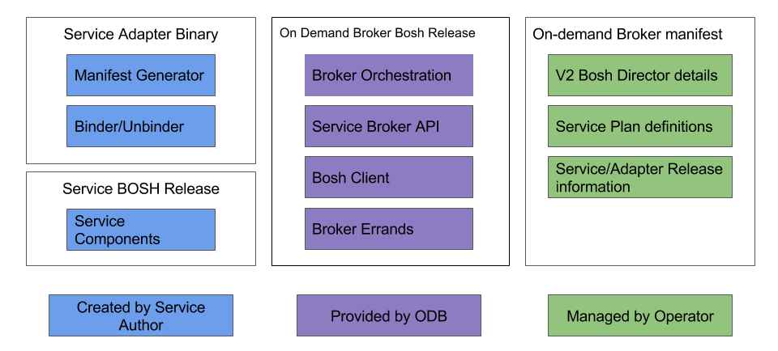

## What is a Cloud Foundry service broker?

A Cloud Foundry service broker allows application developers to provision services to be used by their Cloud Foundry apps. They are implemented as HTTP servers that conform to the [service broker API](http://docs.cloudfoundry.org/services/api.html). These brokers are registered with Cloud Controller in order to populate a service marketplace.

## What is an on-demand service broker?

An on-demand Cloud Foundry service broker is a service broker that provisions IAAS resources at service instance creation time, as opposed to pre-provisioning a fixed quantity of these resources at broker deployment time. The **On-demand Service Broker (ODB)** is a generic on-demand service broker for single-tenant (dedicated service process/cluster per Cloud Foundry service instance) service offerings where one service instance corresponds to one BOSH deployment.

Service-specific functionality is plugged in by the service author via an executable called a **Service Adapter**. For more information about the responsibilities of Service Authors, please see [Creating the Service Author Deliverables](creating.html).

The Pivotal approaches leverages native platform features, such as BOSH 2.0, OpsManager and Elastic Runtime. No additional or 3rd party components other than the service broker and the BOSH release for the service itself are required. This greatly simplifies the setup, everything is done through the single install process as per today, it simplifies support as there are less moving parts and there is less customisation required of the customer’s network around specific DNS rules and additional firewall ports over and above what they already require.

The ODB will be the standard approach to deploying on-demand services across all Pivotal products and the ISV ecosystem of partners.

This approach does not impose any constraints on the tile author's ability to offer new functionality or expose configuration options in their service plans, such as rate limiting, external load balancers.

## What is a service adapter?

A service adapter is a binary which would be called out by the ODB, when it wants to do service-specific tasks.

The above diagram shows where responsibility lies for each aspect of the ODB workflow.

You can see that the service author can now focus on building the BOSH release of their service and simply provide a service adapter binary that is responsible for managing the manifest generation and binding / unbinding. The ODB manages all interactions with Cloud Foundry and BOSH.

The operator will then configure a range of plans for the service in the ODB BOSH manifest. This gives the operator control of what service configurations to offer their app developers. There is consistency of experience for the Operator in terms of how to install, configure and upgrade the Pivotal products using this approach.

## Why provision IAAS resources on-demand?

* Scale resource consumption linearly with need, without having to plan for pre-provisioning.
* Application developers get some control over resources, and do not have to do acquire them through the operator.

## Why use ODB to develop on-demand service offerings?

* ODB reduces the amount of code service developers have to write by abstracting away functionality common to most single-tenant on-demand service brokers.
* ODB uses BOSH to deploy service instances, so anything that is BOSH-deployable can be integrated with Cloud Foundry's services marketplace.

### BOSH v2 Features we use

* Dynamic IP management
* Availability zones
* Globally-defined resources (**Cloud Config**). This results in manifests that are portable across BOSH CPIs, and are substantially smaller than old-style manifests.
* Links: deployed BOSH instances consuming information (e.g. IP address) of other instances.

## Steps required to use on-demand service broker

The follow steps are required to create and maintain an ODB:

* [The Service Authors provide their deliverables](creating.html)
* [The Operators upload their releases and write a manifest](operating.html)
