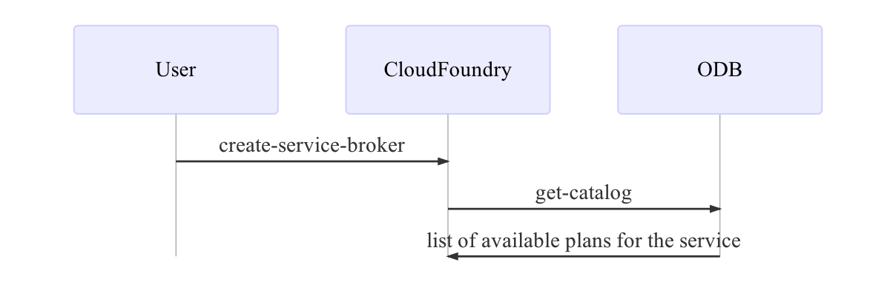
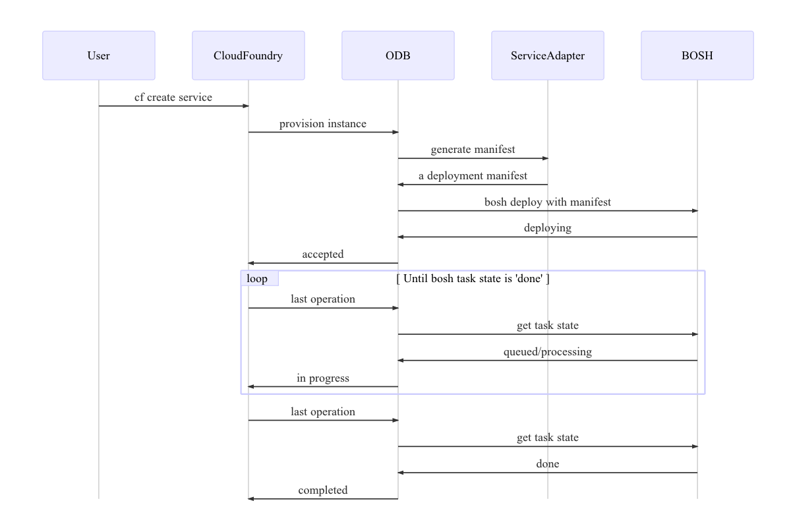
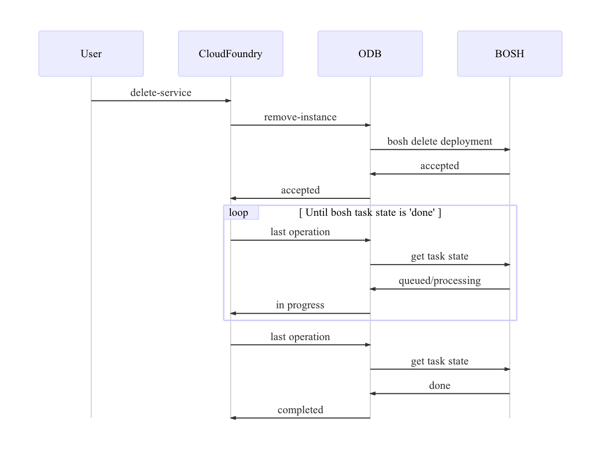
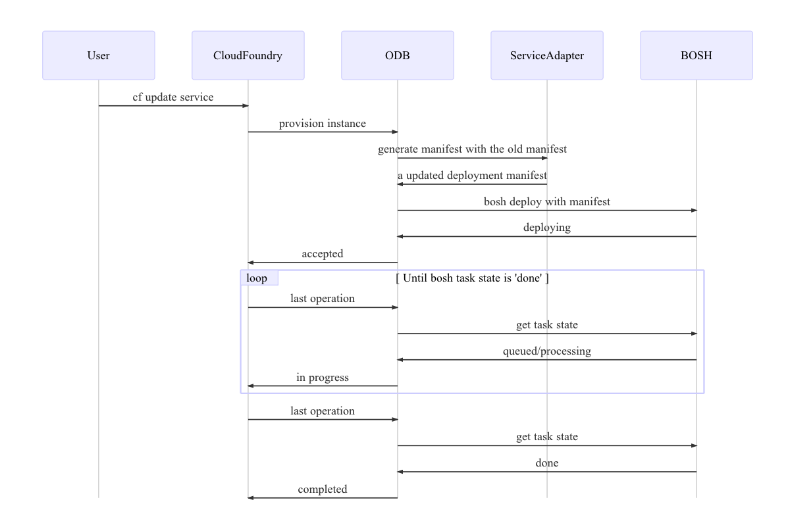
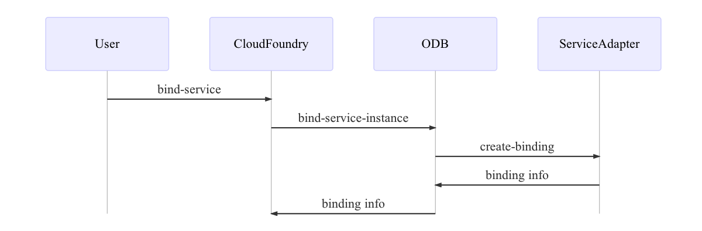
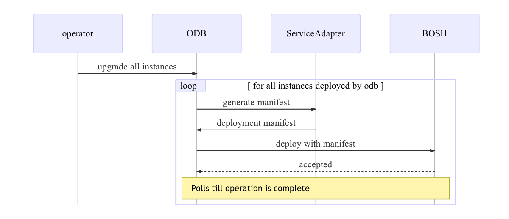
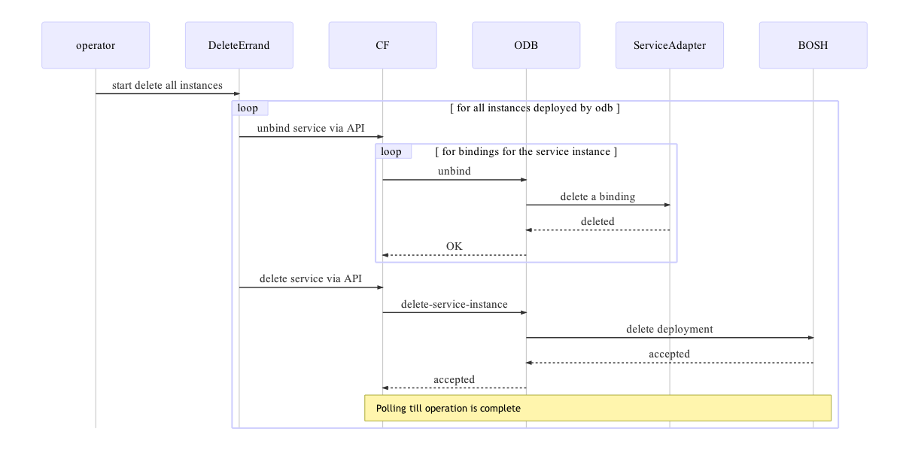

# Concepts

The following page contains concepts relevant to the setting up and maintaining of a service instance. The diagrams allow you to see which tasks are undertaken by the ODB and which require interaction with the Service Adapter.

- [Register service broker](#catalog)
- [Create service instance](#create-service-instance)
- [Delete service instance](#delete-service-instance)
- [Update service instance](#update-service-instance)
- [Bind](#bind)
- [Unbind](#unbind)
- [Upgrade all instances](#upgrade-all-instances)
- [Delete all instances](#delete-all-instances)

## ODB Workflows

### Register Service Broker with Cloud Foundry

### Create service instance
Note that there are two ways this can fail: synchronously and asynchronously. When it fails synchronously, the Cloud Controller will subsequently delete the service according to its [orphan mitigation strategy](http://docs.cloudfoundry.org/services/api.html#orphans). In the case when it fails asynchronously (e.g. while bosh deploys the service instance), the Cloud Controller won't issue a delete request.

### Delete service instance
In the delete service workflow the service adapter is not invoked 

### Update service instance

### Bind

### Unbind

### Upgrade all instances
ODB provides BOSH errand to upgrade all the instances managed by the broker. This can also be used in the scenario when a plan changes; this errand will update all instances that implement the plan with the new plan definition. 

### Delete all instances
ODB provides BOSH errand to delete all the instances managed by the broker. 

**[Back to Contents Page](index.html)**
